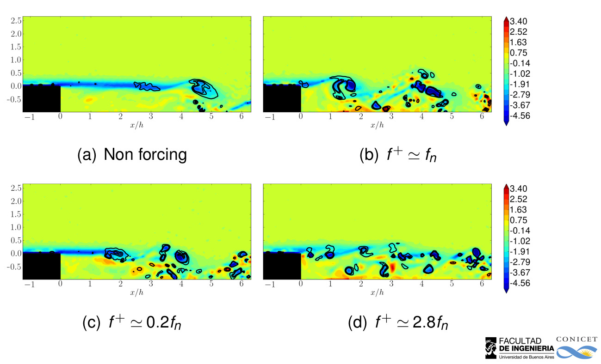
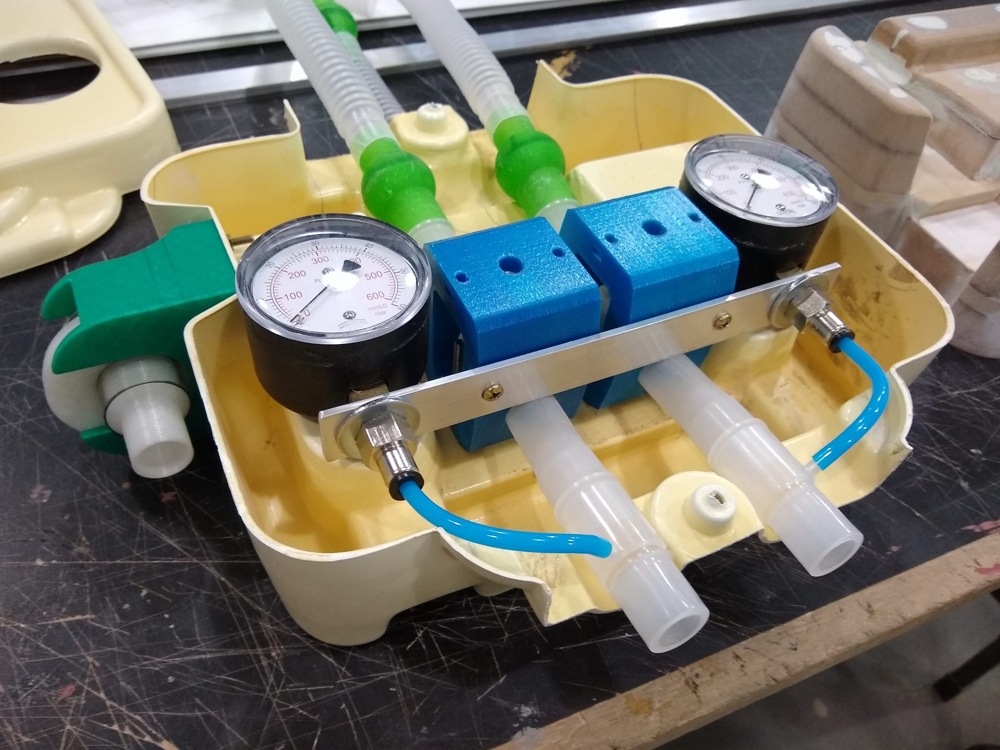

|-----------------------|-------|
|  **Transport of flexible fibres in model porous media:**: | <video width="380" height="300" autoplay loop controls="controls"><source src='./fibra_obst.mp4' type="video/mp4"></video> |
| **Buckling of flexible filaments in viscous media.**:  | <video width="480" height="160" autoplay loop controls="controls"><source src='./compresion filamentos.mp4' type="video/mp4"></video>|
| **Bubble motion in confined geometriess**:  | <video width="100" height="320" autoplay loop controls="controls"><source src='./velocity_field_slowmotion.mp4' type="video/mp4"></video>|
| **Reduced Order Models**:  | <video width="480" height="320" autoplay loop controls="controls"><source src='./cluster_ted.mp4' type="video/mp4"></video>|
| **Flow Control**:  | |
| **COVID 19**:  | |

